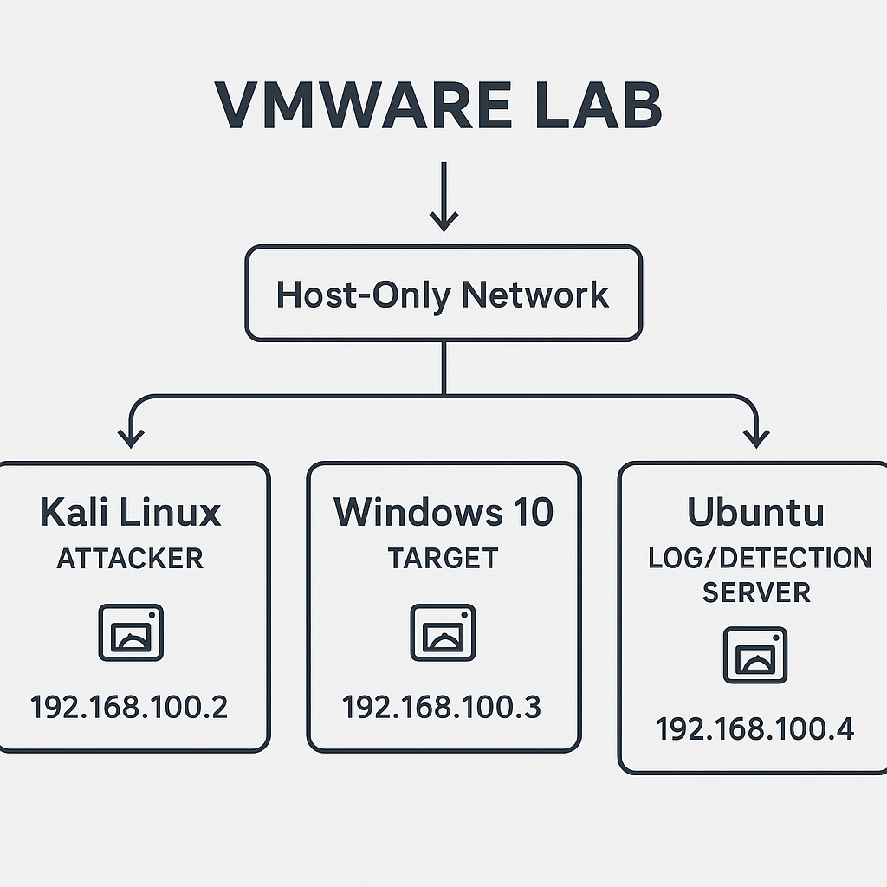

# Stage 1 — Lab Setup (Kali → Windows → Ubuntu)

**Purpose:**  
Build a safe, isolated VMware lab and verify that the virtual machines (VMs) can communicate with each other.  
This is the foundation for later Attack + Detect stages.

---

## 📁 What this stage includes
- `infra/vm_specs.md` — VM names, specs, IPs, and snapshots  
- `artifacts/screenshots/` — proof screenshots (IPs, pings, VMnet)  

---

## 🌐 Network and VMs

- Network: **Host-only (VMnet1)** — `172.16.94.0/24` (no gateway)
- IP addresses:
  - **Kali (attacker):** `172.16.94.128`
  - **Ubuntu (log/detection):** `172.16.94.131`
  - **Windows 10 Pro x64 (target):** `172.16.94.133`

---

# VM Specs — Host-only Attack+Detect Lab

**Network:** Host-only (VMnet1) — `172.16.94.0/24`

| VM Name | Role            | OS / Version        | RAM  | vCPU | Disk  | IP Address       | Snapshots                             |
|---------|-----------------|---------------------|------|------|-------|------------------|----------------------------------------|
| Kali    | Attacker        | Kali Rolling 2025.x | 4 GB | 2    | 40 GB | 172.16.94.128    | `kali_clean`                           |
| Windows | Target (Victim) | Windows 10 Pro x64  | 8 GB | 2–4  | 60 GB | 172.16.94.133    | `win10_x64_clean`, `win10_preexploit` |
| Ubuntu  | Log / Detection | Ubuntu 22.04 LTS    | 6–8G | 2    | 40 GB | 172.16.94.131    | `ubuntu_clean`                         |

---

### Notes
- **Host-only** = isolated lab (no gateway).  
- Add **NAT only when needed** for updates; then disconnect it for testing.  
- Always **snapshot before scanning or exploiting**.

---

### Screenshots (click to enlarge)
<p align="left">
  <a href="artifacts/screenshots/Diagram_lab.png"></a>
  <a href="artifacts/screenshots/Kali_ip.png"></a>
  <a href="artifacts/screenshots/Ubuntu_ip.png"></a>
</p>
<p align="left">
  <a href="artifacts/screenshots/Windows_ip.png"></a>
  <a href="artifacts/screenshots/Verify_ping.png"></a>
</p>

---


## 🧩 Commands used (from Kali)

```bash
# list network interfaces
ip a

# check routing table
ip r

#!/bin/bash
# verify_connectivity.sh - run from Kali
targets=(172.16.94.131 172.16.94.133)
for ip in "${targets[@]}"; do
  echo "Pinging $ip ..."
  ping -c 4 $ip
done
---


